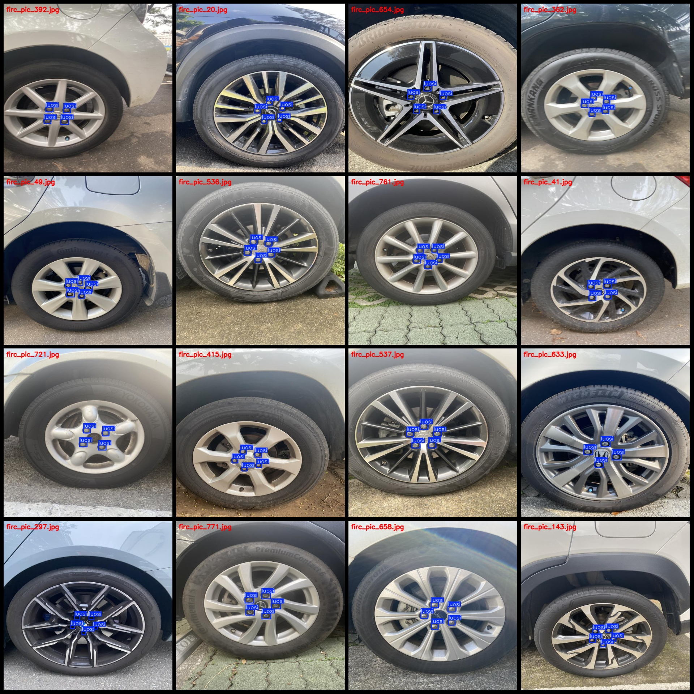
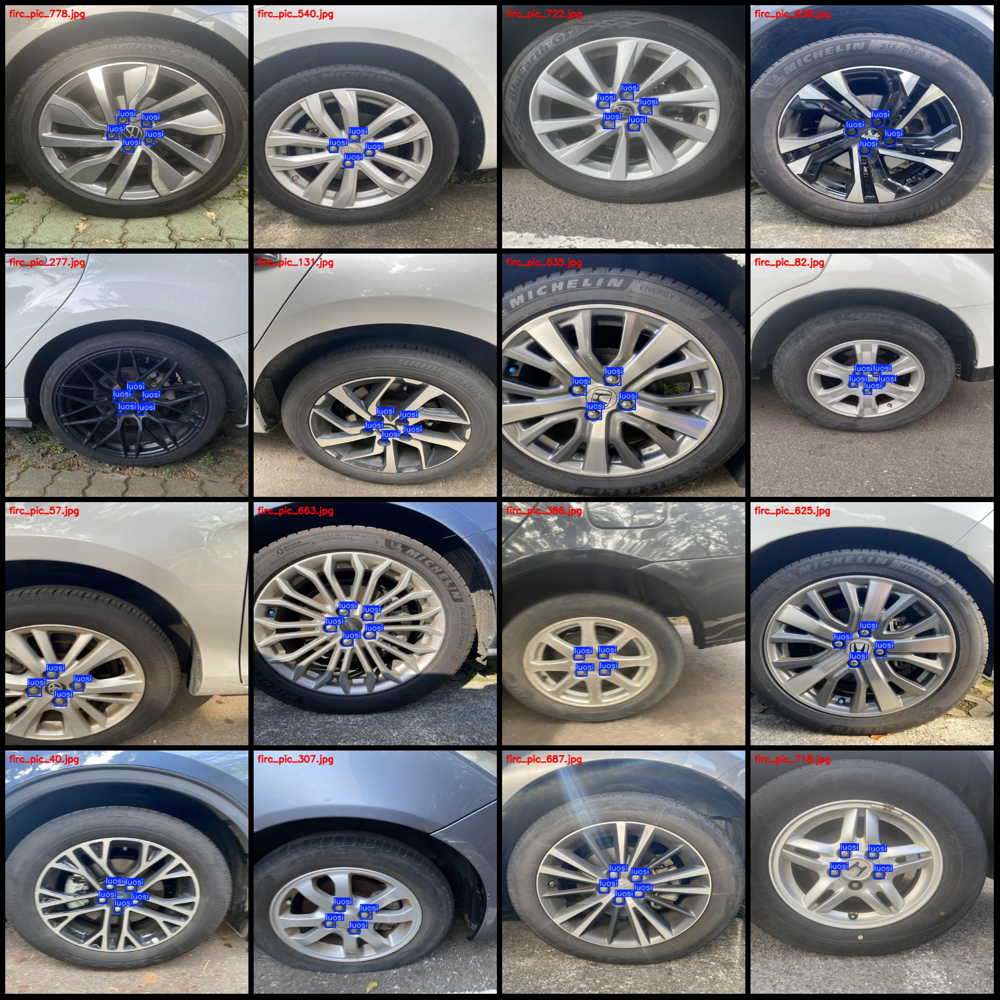

# Vehicle Wheel Tire Screw Detection Dataset VOC+YOLO Format with 814 Images in 1 Category

The dataset format is: Pascal VOC format + YOLO format (without the segmentation path in the txt file, only containing JPG images and their corresponding VOC format XML files and YOLO format txt 
files).
Number of images (JPG file count): 814
Number of labels (XML file count): 814
Number of labels (txt file count): 814
Number of label categories: 1
Label category name: ["luosi"]
Number of bounding boxes for each category:
luosi = 3833
Total bounding boxes: 3833
Number of images per category:
luosi = 814
Image resolution: 640x640
Annotation tool used: labelImg
Annotation rules: draw a rectangle around the category
Important note: The dataset does not have separate training, validation, and test sets; you need to manually divide them.
Special statement: This dataset does not guarantee the accuracy of the trained model or weight files.
Preview of the images:
Annotation example:

## Image

Here is a pay link on Stripe ( https://buy.stripe.com/3cs8yP7sY87d0vu9AB ). Please contact me lonlonago@foxmail.com after funding $89, and I will send you a complete data files , thank you!

